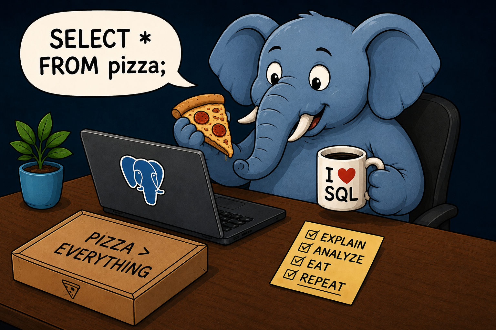
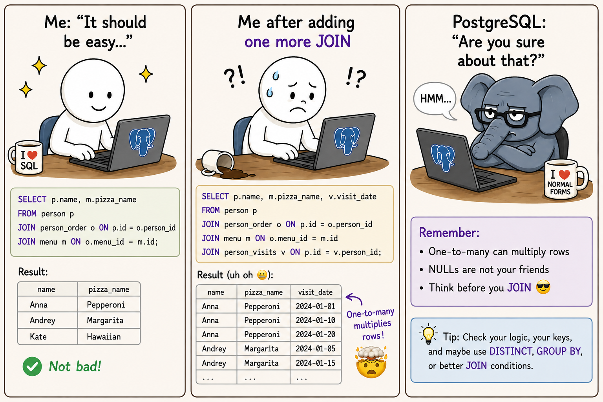
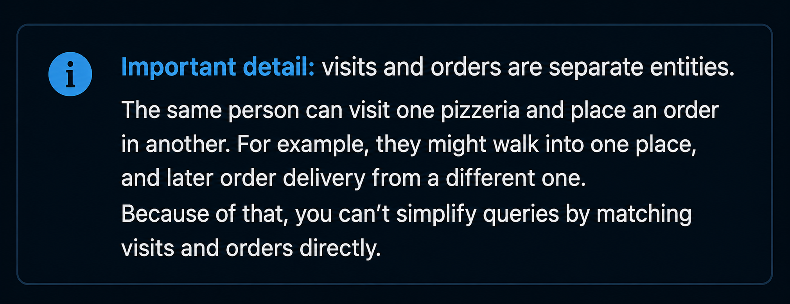
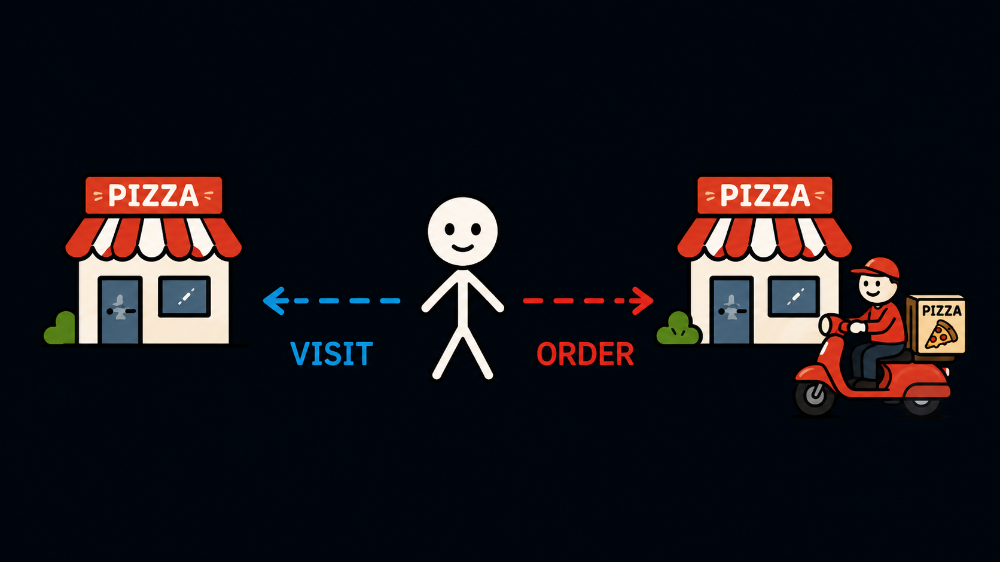
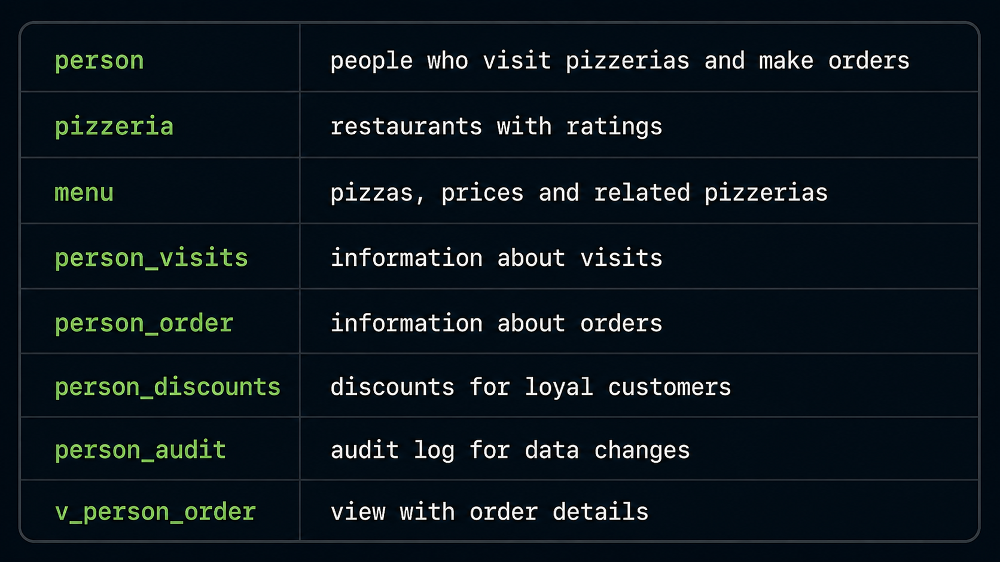
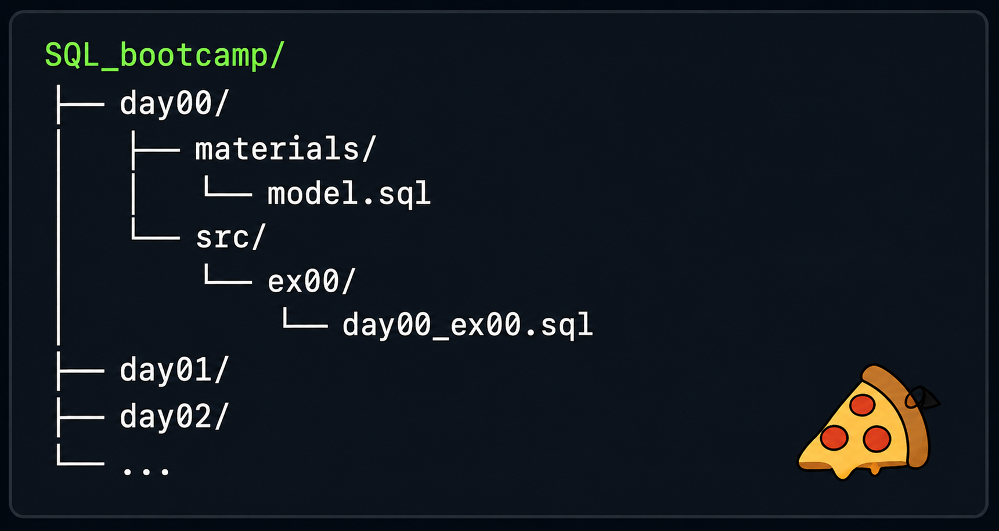
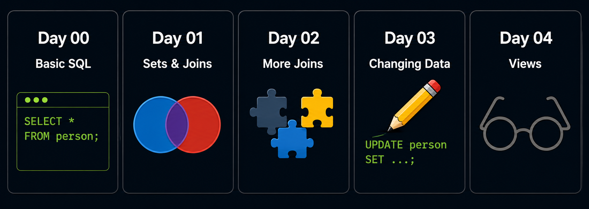
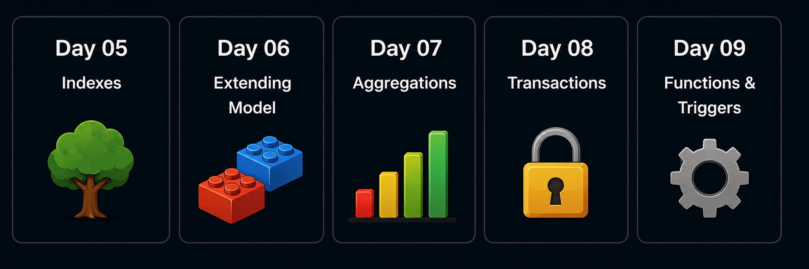
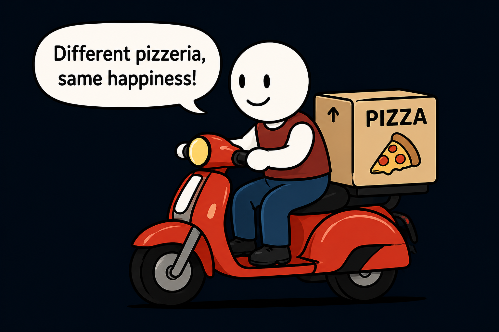
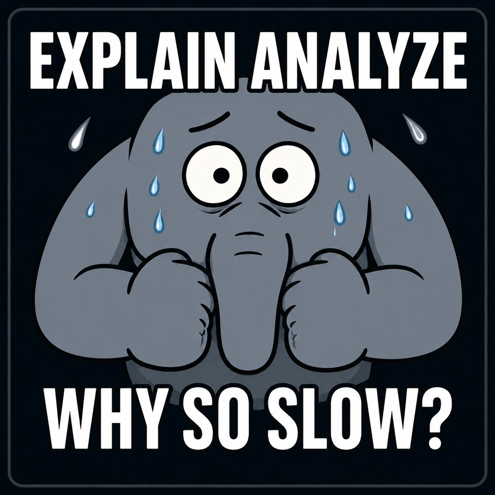

# SQL Bootcamp 🍕🐘

*(PostgreSQL practice project)*

I never thought pizza orders could teach me so much about databases 😳

This repository contains my solutions for the SQL Bootcamp tasks 🎓

The project starts with a small pizza ordering database and gradually moves
from simple `SELECT` queries to joins, indexes, transactions, triggers, and functions 💆🏽‍♀️

 

🍕 ─────────────── 🐘 ─────────────── 🍕

## 🎯 What is this project about?

1. People visit pizzerias 👣
2. Pizzerias have menus 🍕
3. People make orders 🧾
4. Orders are linked to menu items, not directly to visits 🔗
5. Later days add discounts, views, indexes, audit tables, triggers, sequences, and functions ⚙️
6. PostgreSQL watches my queries and says: "Are you sure?" 🫣

🍕 ─────────────── 🐘 ─────────────── 🍕

 

🍕 ─────────────── 🐘 ─────────────── 🍕

## 🛠️ Tech Stack

🍕 ─────────────── 🐘 ─────────────── 🍕

## 🔍 About the database

The project starts with a small relational model and later extends it with additional database objects:

🍕 ─────────────── 🐘 ─────────────── 🍕

## 🧩 Project layout

Solutions are split by days from `day00` to `day09`

Each day contains exercise folders with SQL files inside

Example:

🍕 ─────────────── 🐘 ─────────────── 🍕

## 📚 Topics covered

<table>
  <tr>
    <th>Day 00 Basic SQL</th>
    <th>Day 01 Sets and joins</th>
    <th>Day 02 More joins</th>
    <th>Day 03 Changing data</th>
    <th>Day 04 Views</th>
  </tr>
  <tr>
    <td valign="top">
      First queries over the relational model:
        
      <ul>
        <li><code>SELECT</code></li>
        <li><code>WHERE</code></li>
        <li><code>ORDER BY</code></li>
        <li><code>DISTINCT</code></li>
        <li>calculated columns</li>
        <li><code>CASE</code></li>
        <li>simple subqueries</li>
      </ul>
    </td>
    <td valign="top">
      Working with data as sets:
        
      <ul>
        <li><code>UNION</code></li>
        <li><code>UNION ALL</code></li>
        <li><code>INTERSECT</code></li>
        <li><code>EXCEPT</code></li>
        <li>duplicates</li>
        <li>Cartesian product</li>
        <li>basic joins</li>
        <li><code>IN</code> and <code>EXISTS</code></li>
      </ul>
    </td>
    <td valign="top">
      More practice with table relationships:
        
      <ul>
        <li><code>LEFT JOIN</code></li>
        <li><code>RIGHT JOIN</code></li>
        <li><code>FULL JOIN</code></li>
        <li>missing data</li>
        <li><code>generate_series</code></li>
        <li>CTE</li>
        <li>self-joins</li>
      </ul>
    </td>
    <td valign="top">
      Working with DML:
        
      <ul>
        <li><code>INSERT</code></li>
        <li><code>UPDATE</code></li>
        <li><code>DELETE</code></li>
        <li><code>INSERT INTO ... SELECT</code></li>
        <li>dynamic ids</li>
        <li>data consistency after changes</li>
      </ul>
    </td>
    <td valign="top">
      Reusable database objects:
        
      <ul>
        <li>views</li>
        <li>materialized views</li>
        <li>generated date views</li>
        <li>refreshing materialized views</li>
        <li>dropping created objects</li>
      </ul>
    </td>
  </tr>
</table>

<table>
  <tr>
    <th>Day 05 Indexes</th>
    <th>Day 06 Extending the model</th>
    <th>Day 07 Aggregations</th>
    <th>Day 08 Transactions</th>
    <th>Day 09 Functions and triggers</th>
  </tr>
  <tr>
    <td valign="top">
      Query performance basics:
        
      <ul>
        <li>B-tree indexes</li>
        <li>foreign key indexes</li>
        <li>functional indexes</li>
        <li>multi-column indexes</li>
        <li>unique indexes</li>
        <li>partial indexes</li>
        <li><code>EXPLAIN ANALYZE</code></li>
      </ul>
    </td>
    <td valign="top">
      Adding a discount feature:
        
      <ul>
        <li>new table design</li>
        <li>primary keys</li>
        <li>foreign keys</li>
        <li>constraints</li>
        <li>default values</li>
        <li>comments</li>
        <li>sequences</li>
      </ul>
    </td>
    <td valign="top">
      Getting statistics from data:
        
      <ul>
        <li><code>COUNT</code></li>
        <li><code>AVG</code></li>
        <li><code>MIN</code></li>
        <li><code>MAX</code></li>
        <li><code>GROUP BY</code></li>
        <li><code>HAVING</code></li>
        <li>rounding and type conversion</li>
      </ul>
    </td>
    <td valign="top">
      Working with concurrent sessions:
        
      <ul>
        <li>transactions</li>
        <li>isolation levels</li>
        <li><code>READ COMMITTED</code></li>
        <li><code>REPEATABLE READ</code></li>
        <li><code>SERIALIZABLE</code></li>
        <li>lost update</li>
        <li>non-repeatable read</li>
        <li>phantom read</li>
        <li>deadlock</li>
      </ul>
    </td>
    <td valign="top">
      Database-side logic:
        
      <ul>
        <li>audit tables</li>
        <li>trigger functions</li>
        <li>insert/update/delete triggers</li>
        <li>generic audit trigger</li>
        <li>SQL functions</li>
        <li>PL/pgSQL functions</li>
        <li>parameterized functions</li>
      </ul>
    </td>
  </tr>
</table>

🍕 ─────────────── 🐘 ─────────────── 🍕

## 🟢 Running locally

I run PostgreSQL in `Docker` / `OrbStack`

Connection example:

| Parameter | Value |
|---|---|
| Host | `localhost` |
| Port | `5432` |
| Database | `postgres` |
| User | `postgres` |
| Password | `postgres` |

Before running the tasks, apply the database model:

`dayXX/materials/model.sql`

Then `run` the exercise files from the corresponding `src` directory

🍕 ─────────────── 🐘 ─────────────── 🍕

## 📌 Notes

This is a personal practice project 👀

The main purpose is to learn by doing, make mistakes, fix them, and slowly become less afraid of SQL 🐘

